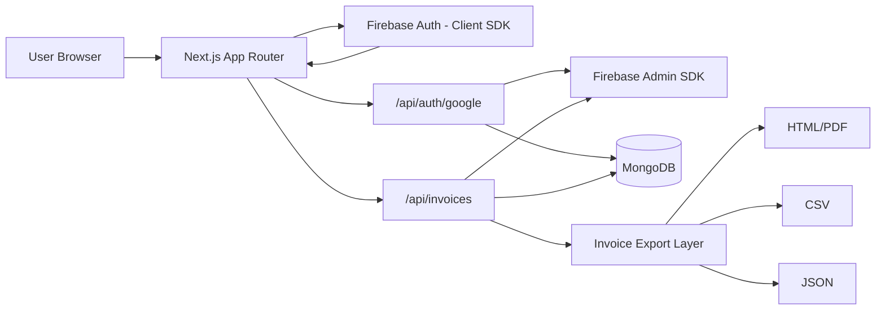
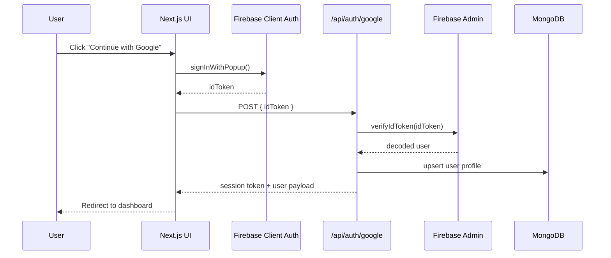
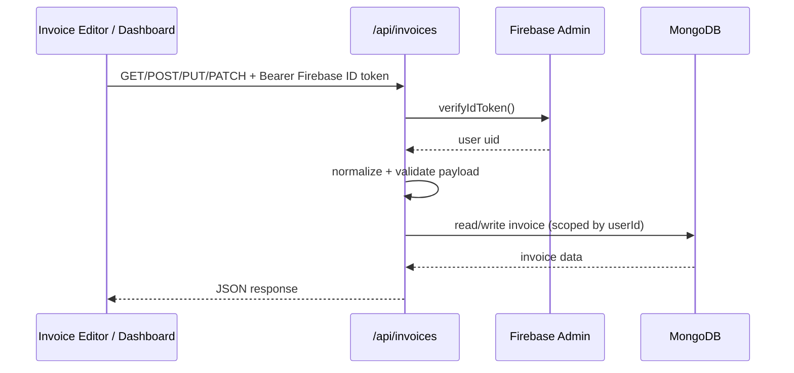
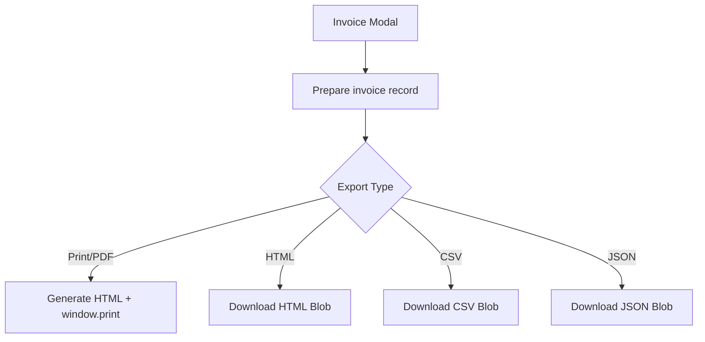
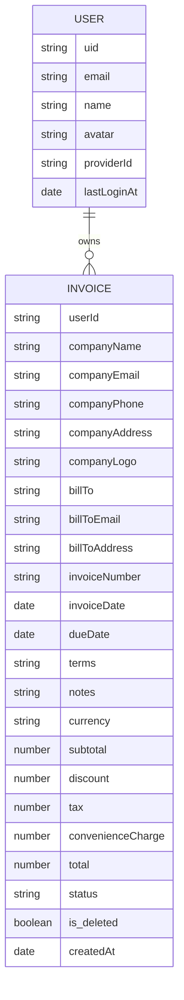

# Invoicey

Invoicey is a production-focused invoicing app built with Next.js App Router, Firebase Auth, and MongoDB.
It helps users create, edit, manage, preview, and export professional invoices quickly.

## Table of Contents

1. [Product Overview](#product-overview)
2. [Core Features](#core-features)
3. [Tech Stack](#tech-stack)
4. [Architecture](#architecture)
5. [Data Flow](#data-flow)
6. [Project Structure](#project-structure)
7. [Getting Started (Bun)](#getting-started-bun)
8. [Environment Variables](#environment-variables)
9. [Scripts](#scripts)
10. [API Surface](#api-surface)
11. [Data Model](#data-model)
12. [UI and Theming](#ui-and-theming)
13. [Docker (Multi-Stage, Bun)](#docker-multi-stage-bun)
14. [Security Notes](#security-notes)
15. [Manual QA Checklist](#manual-qa-checklist)
16. [Roadmap Suggestions](#roadmap-suggestions)

## Product Overview

Invoicey is designed for freelancers, founders, and small teams that need a simple but polished billing workflow:

- Sign in with Google
- Create invoices with complete business and client details
- Manage invoice lifecycle from dashboard
- Export invoices to Print/PDF, HTML, CSV, and JSON
- Support dark/light theme

## Core Features

- Firebase-powered Google authentication
- Invoice CRUD APIs with Firebase ID token verification
- MongoDB persistence with Mongoose models
- Soft-delete and settle-to-paid actions
- Invoice editor with:
  - line item management
  - date picker calendar fields
  - currency + status select fields
  - company logo URL support
  - live preview
- AI-assisted invoice drafting from natural language prompts with follow-up clarification
- Export formats:
  - Print/PDF
  - HTML
  - CSV
  - JSON
- Persistent light/dark mode toggle

## Tech Stack

- **Framework**: Next.js 16 (App Router)
- **Language**: TypeScript
- **UI**: shadcn/ui + Aceternity UI patterns
- **Auth**:
  - Firebase client SDK (frontend sign-in)
  - Firebase Admin SDK (backend token verification)
- **Database**: MongoDB + Mongoose
- **Package Manager / Runtime**: Bun

## Architecture



## Data Flow

### 1) Authentication Flow



### 2) Invoice CRUD + Management Flow



### 3) Export Flow



## Project Structure

```text
invoicey/
  app/
    api/
      ai/invoice-assistant/route.ts
      auth/google/route.ts
      invoices/route.ts
    about/page.tsx
    auth/page.tsx
    contact/page.tsx
    create-invoice/
      page.tsx
      [id]/page.tsx
    dashboard/page.tsx
    pricing/page.tsx
    layout.tsx
    page.tsx
  components/
    InvoiceAiAssistant.tsx
    InvoiceEditor.tsx
    InvoiceModal.tsx
    ui/
      button.tsx
      card.tsx
      input.tsx
      textarea.tsx
      select-field.tsx
      date-picker-field.tsx
      calendar.tsx
      popover.tsx
      ...
  lib/
    ai/invoice-assistant/
      apply-patch.ts
      contracts.ts
      normalization.ts
      prompt.ts
      provider.ts
      service.ts
    firebase.ts
    mongodb.ts
    invoice-export.ts
    invoices.ts
    theme.ts
  models/
    Invoice.ts
    User.ts
  modules/
    UserSessionManager.ts
```

## Getting Started (Bun)

### 1) Prerequisites

- Bun >= 1.0
- MongoDB instance
- Firebase project with Google auth enabled

### 2) Install Dependencies

```bash
bun install
```

### 3) Configure Environment

```bash
cp .env.sample .env.local
```

Then fill all required values.

### 4) Run Development Server

```bash
bun dev
```

App runs at `http://localhost:3000`.

## Environment Variables

| Variable | Required | Description |
|---|---|---|
| `NEXT_PUBLIC_FIREBASE_API_KEY` | Yes | Firebase client config |
| `NEXT_PUBLIC_FIREBASE_AUTH_DOMAIN` | Yes | Firebase auth domain |
| `NEXT_PUBLIC_FIREBASE_PROJECT_ID` | Yes | Firebase project id |
| `NEXT_PUBLIC_FIREBASE_STORAGE_BUCKET` | Yes | Firebase storage bucket |
| `NEXT_PUBLIC_FIREBASE_MESSAGING_SENDER_ID` | Yes | Firebase messaging sender id |
| `NEXT_PUBLIC_FIREBASE_APP_ID` | Yes | Firebase app id |
| `NEXT_PUBLIC_FIREBASE_MEASUREMENT_ID` | Optional | Firebase analytics id |
| `FIREBASE_ADMIN_CREDENTIALS` | Yes | Firebase Admin service account JSON or base64 JSON |
| `MONGODB_URI` | Yes | MongoDB connection URI |
| `JWT_SECRET` | Yes | Secret used for session token signing |
| `GEMINI_API_KEY` | Yes (for AI assistant) | Gemini API key used by `/api/ai/invoice-assistant` |
| `GEMINI_MODEL` | Optional | Gemini model id (default: `gemini-2.5-flash`) |
| `INVOICE_AI_PROVIDER` | Optional | Provider switch for AI assistant (default: `gemini`) |

## Scripts

All scripts run with Bun:

```bash
bun dev         # local development
bun run lint    # eslint checks
bun run build   # production build
bun run start   # production server
```

## API Surface

### `POST /api/auth/google`

- Validates Firebase ID token
- Upserts user in MongoDB
- Returns session token + user metadata

### `GET /api/invoices`

- List invoices for authenticated user
- `?id=<invoiceId>` returns single invoice

### `POST /api/invoices`

- Creates a new invoice for authenticated user
- Normalizes line items and totals

### `POST /api/ai/invoice-assistant`

- Accepts natural language invoice input + current form draft
- Uses Gemini to extract normalized invoice fields
- Returns form patch payload and clarification questions

### `PUT /api/invoices?id=<invoiceId>`

- Full invoice update
- Re-validates payload and recalculates totals

### `PATCH /api/invoices?id=<invoiceId>`

- Action-based updates:
  - `action: "settle"` -> status `paid`
  - `action: "soft_delete"` -> `is_deleted: true`
  - or direct `status` update

## Data Model



## UI and Theming

- UI primitives are built around shadcn patterns.
- Aceternity components are used for visual styling/atmosphere.
- Theme system:
  - `light` and `dark` mode
  - persisted in `localStorage`
  - initialized in `app/layout.tsx` using pre-hydration script
- Invoice editor uses componentized fields:
  - `SelectField` for enums/options
  - `DatePickerField` for date inputs

## Docker (Multi-Stage, Bun)

This repo includes a Bun-based multi-stage Dockerfile for production.

### Build image

```bash
docker build -t invoicey:latest .
```

### Run container

```bash
docker run --rm -p 3000:3000 --env-file .env invoicey:latest
```

## Security Notes

- Never commit real secrets.
- Keep `FIREBASE_ADMIN_CREDENTIALS`, `MONGODB_URI`, and `JWT_SECRET` in environment secrets only.
- Do not log auth tokens or sensitive user data.
- Validate external URLs (for example, company logos) before rendering in exports.

## Manual QA Checklist

- Auth:
  - Sign in with Google
  - Sign out and redirect behavior
- Invoice editor:
  - Create invoice end-to-end
  - Edit existing invoice
  - Date picker input works
  - Line items keep focus while typing
  - Company logo appears in preview
- Dashboard:
  - List invoices
  - View modal
  - Settle and delete actions
- Export:
  - Print/PDF
  - HTML
  - CSV
  - JSON
- Theme:
  - Toggle light/dark
  - Persistence across refresh

## Roadmap Suggestions

- Add automated tests (unit + integration + e2e)
- Add RBAC/team billing workspaces
- Add invoice templates
- Add payment links and reminders
- Add analytics and audit logs
